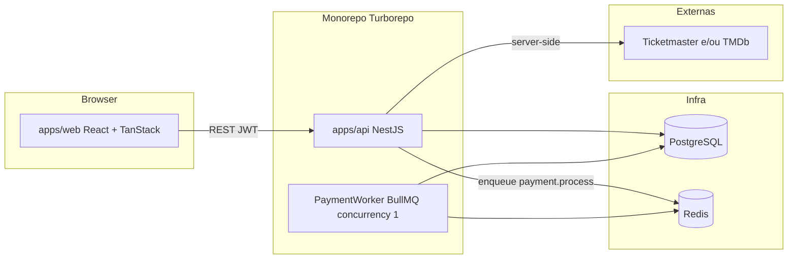
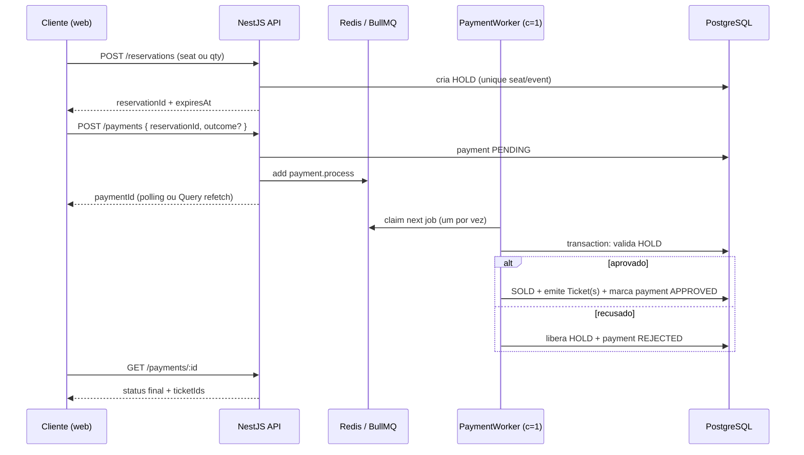

# Architecture — MVP Core: Plataforma de Eventos e Ingressos

| Campo | Valor |
|-------|--------|
| PRD | [`prd.md`](./prd.md) |
| Fonte | `Desafio-Elite-Dev-2026.pdf` |
| Estilo | Modular monolith (API NestJS) + SPA React, monorepo Turborepo |
| Status | Draft — decisões de monorepo, stack e pagamento fechadas |
| Task plan | [`task-plan.md`](./task-plan.md) |
| Design system | [`DESIGN.md`](../../../../../DESIGN.md) |

---

## 1. Context e constraints

| Constraint | Implicação |
|------------|------------|
| Prazo ~7 dias | Preferir fluxo E2E completo; complexidade só onde o enunciado exige (estoque, QR, papéis) |
| Stack obrigatória | React no front; Node no back → NestJS |
| Anti-oversell + pagamento | Fila BullMQ serializa o processamento de pagamento (`concurrency: 1`) |
| Deploy opcional (+1) | SPA + API separáveis; Docker Compose recomendado para Postgres + Redis |
| Avaliadores | Seeds, README, commits descritivos, artefatos versionados |

---

## 2. Decisões arquiteturais (ADRs curtos)

### ADR-001 — Monorepo com Turborepo (não Nx)

**Decisão:** pnpm workspaces + **Turborepo**.

**Por quê:** setup rápido, pipelines `build/dev/lint/test` simples, suficiente para `apps/api` + `apps/web` + `packages/*`. Nx traz generators e graph avançado, mas sobra overhead para um desafio de 7 dias com 2 apps.

**Trade-off:** menos scaffolding Nest/React “de graça”; aceitamos templates manuais ou CLI (`nest new`, `vite`).

### ADR-002 — Backend NestJS modular monolith

**Decisão:** uma API NestJS com módulos por domínio (`Auth`, `Catalog`, `Events`, `Reservations`, `Payments`, `Tickets`, `Gate`).

**Por quê:** alinhado ao desafio, DI clara, guards por papel, encaixa BullMQ via `@nestjs/bullmq`.

### ADR-003 — Frontend React + Vite + TanStack

**Decisão:** SPA com **Vite**, **TanStack Router** (rotas tipadas) e **TanStack Query** (server state).

**Por quê:** React obrigatório; TanStack cobre cache/mutations do fluxo reserva→pagamento→ingressos sem Redux. Vite facilita preview local; deploy da SPA na Vercel (API em outro host ou container).

### ADR-004 — Pagamento simulado via BullMQ (worker serial)

**Decisão:** checkout enfileira job `payment.process`; worker com **`concurrency: 1`** processa um pagamento por vez: valida estoque/hold → aplica resultado simulado (aprovado/recusado) → emite ingresso ou libera hold.

**Por quê:** pedido explícito do time; serialização global reduz corrida no estoque sem locks distribuídos complexos no MVP.

**Trade-off:** throughput baixo sob carga — aceitável para o desafio. Refinamento futuro: fila por `eventId` ou lock otimista no banco + concurrency > 1.

### ADR-005 — Persistência PostgreSQL + Redis

**Decisão:** **PostgreSQL** (eventos, reservas, ingressos, usuários); **Redis** (BullMQ). ORM sugerido: **Prisma**.

---

## 3. Visão de alto nível



**Nota:** no MVP o worker pode rodar **no mesmo processo** Nest (`BullModule` + processor) ou em app separado `apps/worker`. Recomendação inicial: **mesmo processo** (menos ops); extrair `apps/worker` se o deploy separar API e consumer.

---

## 4. Estrutura do monorepo

```text
/
├── apps/
│   ├── api/                 # NestJS — HTTP + (opcional) processors BullMQ
│   └── web/                 # React + Vite + TanStack Router/Query
├── packages/
│   ├── shared/              # tipos/DTOs compartilhados (opcional no início)
│   ├── tsconfig/            # configs TS base
│   └── eslint-config/       # lint compartilhado
├── docker-compose.yml       # postgres + redis (+ api/web opcional)
├── turbo.json
├── pnpm-workspace.yaml
└── docs/ways-of-work/...
```

Scripts raiz (exemplo): `pnpm dev` → Turborepo sobe `api` + `web`; infra via `docker compose up -d`.

---

## 5. Backend — módulos NestJS

```text
apps/api/src/
├── main.ts
├── app.module.ts
├── config/                  # ConfigModule + validação env
├── common/                  # filters, guards, decorators (Roles)
├── prisma/                  # PrismaService
├── auth/                    # login, JWT, roles ORGANIZER | CLIENT | GATE
├── catalog/                 # proxy Ticketmaster / TMDb
├── events/                  # CRUD + publicação
├── reservations/            # hold de assento/quantidade
├── payments/                # enqueue + status do pagamento
│   └── processors/          # PaymentProcessor (concurrency: 1)
├── tickets/                 # emissão, QR payload, share link
├── gate/                    # validação VALID | INVALID | ALREADY_USED | WRONG_EVENT
└── seed/                    # organizador, 2 clientes, portaria, 1 evento
```

### Responsabilidades

| Módulo | Responsabilidade |
|--------|------------------|
| `auth` | Credenciais, JWT, `RolesGuard` |
| `catalog` | Busca externa; API keys só no server |
| `events` | Evento com data, local, capacidade, preço, modo de venda |
| `reservations` | Cria **hold** temporário (assento ou qty); não emite ingresso |
| `payments` | Aceita intenção de pagamento → job BullMQ; expõe status |
| `tickets` | Código não forjável (HMAC/JWT assinado), QR, link de share |
| `gate` | Check-in atômico; impede segunda validação |

### Autorização por papel

| Papel | Capacidades |
|-------|-------------|
| `ORGANIZER` | Catálogo, criar/gerir eventos |
| `CLIENT` | Listar eventos, reservar, pagar, meus ingressos, share |
| `GATE` | Validar ingresso (câmera/manual) no contexto do evento |

---

## 6. Fluxo de reserva e pagamento (BullMQ)



### Regras de concorrência

1. **Unicidade de lugar:** constraint UNIQUE `(eventId, seatId)` (modo mapa) ou contador atômico de capacidade (modo pista), aplicado já no HOLD.
2. **Serialização do pagamento:** worker `concurrency: 1` processa um job por vez — evita corridas no passo hold→sold mesmo sob double-submit.
3. **Idempotência:** `jobId` / `paymentId` único; reprocessamento não emite ingresso duplicado.
4. **Hold com TTL:** job ou cron libera HOLDs expirados (simples: rejeitar no worker se `expiresAt < now` e limpar).

### Simulação de pagamento

- Cliente (ou flag de teste) indica **aprovar** ou **recusar**; o worker aplica essa decisão — sem gateway real.
- Alternativa futura: sandbox Stripe; fora do caminho crítico do MVP.

### Config BullMQ (contrato)

```ts
// fila: "payments"
// job: "payment.process"
// worker: { concurrency: 1 }
// payload: { paymentId: string }
```

---

## 7. Frontend — React + TanStack

```text
apps/web/src/
├── main.tsx
├── routes/                  # TanStack Router
│   ├── index               # listagem / busca eventos
│   ├── login
│   ├── organizer/          # criar/gerir eventos
│   ├── events/$eventId     # detalhe + reserva
│   ├── checkout/$reservationId
│   ├── my-tickets
│   ├── tickets/share/$token
│   └── gate/               # scanner + input manual
├── features/               # UI por domínio
├── lib/api.ts              # fetch client + JWT
└── lib/query-client.ts     # TanStack Query
```

| Lib | Uso |
|-----|-----|
| TanStack Query | Listagens, status de pagamento (poll enquanto `PENDING`), meus ingressos |
| TanStack Router | Rotas tipadas + loaders leves |
| QR | Geração no cliente a partir do código assinado; leitura na portaria via `BarcodeDetector` / lib de câmera |
| Auth | JWT em memory + httpOnly cookie **ou** `localStorage` (documentar trade-off; preferir httpOnly se API no mesmo site) |

UI: identidade própria (evitar “AI slop”); uma composição clara por fluxo (descoberta → reserva → checkout → ingresso → portaria).

---

## 8. Modelo de dados (esboço)

```text
User            id, email, passwordHash, role
Event           id, organizerId, externalRef, title, venue, startsAt,
                capacity, priceCents, saleMode (SEAT_MAP | GA_QTY), status
Seat            id, eventId, label, row, col   // se SEAT_MAP
Reservation     id, eventId, userId, status (HOLD|EXPIRED|CONVERTED|CANCELLED),
                expiresAt, seatId? | quantity?
Payment         id, reservationId, status (PENDING|APPROVED|REJECTED),
                simulatedOutcome, createdAt
Ticket          id, eventId, userId, paymentId, codeHash, codePayload,
                status (ISSUED|USED), usedAt?, shareToken?
GateScan        id, ticketId, eventId, result, scannedBy, createdAt  // audit opcional
```

**Ingresso não forjável:** `codePayload` = token assinado (HMAC-SHA256 ou JWT com segredo server-side); portaria só confia após verify no API. Persistir hash/jti para marcar `USED`.

---

## 9. APIs (superfície mínima)

| Método | Rota | Papel | Descrição |
|--------|------|-------|-----------|
| POST | `/auth/login` | público | JWT |
| GET | `/catalog/search` | ORGANIZER | Proxy API externa |
| POST | `/events` | ORGANIZER | Criar/publicar |
| GET | `/events` | público/CLIENT | Listar publicados |
| POST | `/reservations` | CLIENT | Criar HOLD |
| POST | `/payments` | CLIENT | Enfileirar pagamento |
| GET | `/payments/:id` | CLIENT | Status |
| GET | `/tickets/me` | CLIENT | Meus ingressos |
| POST | `/tickets/:id/share` | CLIENT | Gera link |
| GET | `/tickets/share/:token` | público* | Visualizar compartilhado |
| POST | `/gate/validate` | GATE | Body: `{ eventId, code }` → enum resultado |

\*Share: token opaco de leitura; sem escalar privilégios.

---

## 10. Infra local e entrega

```yaml
# docker-compose (mínimo)
services:
  postgres: # :5432
  redis:    # :6379
  # api / web opcionais no compose
```

| Item | Abordagem |
|------|-----------|
| Seeds | Nest command ou `prisma db seed` |
| Env | `.env.example` com `DATABASE_URL`, `REDIS_URL`, `JWT_SECRET`, `TICKET_HMAC_SECRET`, keys TM/TMDb |
| README | setup pnpm, compose, migrar, seed, `pnpm dev`, limitações |
| Deploy | web → Vercel; api → Railway/Render/Fly + Postgres/Redis gerenciados |

---

## 11. Ordem de implementação (alinhada ao PRD)

1. Scaffold Turborepo + `api` Nest + `web` Vite + Compose (PG/Redis)
2. Auth JWT + roles + seeds
3. Catalog + Events
4. Reservations (1 modo de venda) + constraints de estoque
5. Payments + BullMQ worker `concurrency: 1` + emissão de tickets
6. Meus ingressos + QR + share link
7. Gate (manual → câmera)
8. Polimento UI, README, uso de IA, opcionais (testes, deploy)

---

## 12. Riscos e mitigações

| Risco | Mitigação |
|-------|-----------|
| Fila global vira gargalo | Aceito no MVP; documentar; evoluir para concurrency por evento |
| Hold órfão se worker cair | Retry BullMQ + TTL de hold + job idempotente |
| Chave de API no front | Apenas `catalog` no Nest |
| Double-submit no checkout | `paymentId` idempotente + unique reservation→payment |
| Câmera inconsistente | Digitação manual obrigatória como fallback |

---

## 13. Decisões de produto (fechadas)

| Decisão | Escolha | Motivo |
|--------|---------|--------|
| API externa (MVP) | **TMDb** | Encaixa com mapa de assentos estilo cinema; Ticketmaster fica como evolução |
| Modo de reserva | **`SEAT_MAP`** | Fluxo visual forte para o desafio; `GA_QTY` como opcional depois |
| Worker BullMQ | **Mesmo processo da API** | Menos ops no prazo de 7 dias; extrair `apps/worker` só se o deploy exigir |

---

## Context

- **Epic:** Plataforma de Eventos e Ingressos
- **PRD:** `prd.md`
- **Decisões do time:** Turborepo, NestJS, React + TanStack, BullMQ `concurrency: 1` para pagamento
