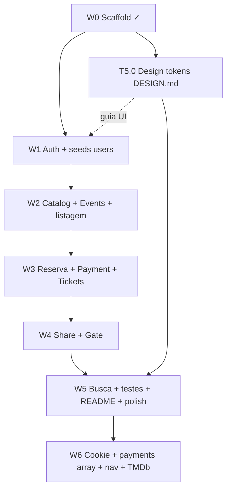

# Task Plan — MVP Core (Escopo B + multi-agente)

| Campo | Valor |
|-------|--------|
| PRD | [`prd.md`](./prd.md) |
| Architecture | [`architecture.md`](./architecture.md) |
| Design system UI | [`DESIGN.md`](../../../../../DESIGN.md) |
| Status | Validado em brainstorming (2026-08-16); auditoria gaps (2026-08-17); plano refinamentos W6 (2026-08-17) |
| Backlog restante | PRD §11–12 (`T-GAP-*`, `T-SEC-*`, `T-PAY-*`, `T-NAV-*`, `T-UX-*`, `T-CAT-*`) |

> **Atualização 2026-08-17 (noite):** W6.1 — plano e implementação dos ajustes de produto: GETs de listagem paginados, scroll infinito, grid maior, cookie httpOnly (sem token no `localStorage`), bloqueio visual de compra duplicada.

> **Atualização 2026-08-17 (T-GAP-04/06):** Playwright alinhado ao checkout (`Confirmar compra`, DuplicateNotice, CTA **Ver ingressos**) e à criação via TMDb. README: `/org` vitrine `now_playing`/`upcoming`, filme obrigatório, poster no card; checkout sem auto-approve no reload. **TMDb lançamentos + `tmdbId`/`posterUrl` obrigatórios no create:** em andamento / fechando nesta onda.

---

## 1. Understanding summary

- Construir a plataforma **Cena** até um MVP avaliável: organizador (TMDb + eventos), cliente (`SEAT_MAP` → pagamento BullMQ → QR/share), portaria (câmera + manual).
- Objetivo: Desafio Elite Dev 2026 — fluxo E2E completo + decisões documentadas.
- Personas: `ORGANIZER`, `CLIENT`, `GATE` (+ avaliador com seeds).
- Stack fechada: Turborepo, NestJS, React/TanStack, Prisma/PostgreSQL, Redis/BullMQ `concurrency: 1`.
- Horizonte **B**: MVP obrigatório + diferenciais leves (busca/filtro, testes, doc de uso de IA).
- Execução **B**: multi-agente — frentes FE/BE paralelas com contratos por wave.
- Testes **C**: testes API nos pontos críticos + 1–2 e2e Playwright (happy path) + checklist manual.
- UI: seguir estritamente **`DESIGN.md`** (Minimal — TUI → tokens web).
- Diferencial reserva: mapa **Three.js** + fallback lista.
- W6: endurecer sessão (cookie), API de pagamento em lote, UX de descoberta (grid/redirect) e vínculo TMDb.

---

## 2. Assumptions

- Scaffold atual (monorepo, Prisma migrate, `/health`, payments stub em memória, SPA mínima) = **feito** (W0).
- Fora do plano: deploy, cancelamento com estoque, mapa realtime, Ticketmaster, modo `GA_QTY`.
- Worker BullMQ no mesmo processo da API.
- Share = link de leitura; sem transferir ownership.
- Seeds obrigatórios no caminho crítico.
- NFRs de desafio: poucos usuários simultâneos; QR não forjável; secrets no server; README como porta do avaliador.
- Tradução TUI→Web: CSS variables a partir da paleta Minimal; box-drawing/`▸` onde couber; sem emoji, sem glow/purple, dark `#0a0a0a`.
- **Sessão:** migrar de `localStorage` → cookie `httpOnly` (W6 / T-SEC).
- **Payments:** batch lógico 1 request → N payments/jobs (sem mudar 1:1 Prisma na 1ª entrega).
- **Navegação:** rotas-página + formulários com scroll (sem modal de criação).
- TTL do HOLD e grid default do seed (ex.: 8×10) continuam flexíveis na implementação.

---

## 3. Decision log

| Decisão | Alternativas | Por quê |
|--------|--------------|---------|
| Escopo B | A só MVP / C nota máxima | MVP + diferenciais leves |
| Execução multi-agente | Solo / híbrido | Paralelismo real FE/BE |
| Testes C | A manual / B só API | Cobertura crítica + e2e leve |
| Organização Approach 1 (waves E2E) | Backend-first / domínios sem wave | E2E cedo + paralelo controlado |
| Design system = `DESIGN.md` | Tema cream do scaffold | Fonte de verdade do produto |
| Tokens cedo (T5.0) | Só no polish final | Evita retrabalho de UI |
| Contrato por wave | Big-bang OpenAPI | Menos overhead no prazo de 7 dias |
| Cookie httpOnly (W6) | Manter localStorage | Mitiga vazamento de JWT por XSS |
| Payments batch lógico | 1 Payment multi-reserva / N POSTs | 1 request UX; Prisma 1:1 intacto |
| Rotas-página + scroll | SPA seções / modais | Clareza de fluxo; anti-AI-slop |
| CLIENT → `/events` | Continuar em `/app` | First screen = eventos disponíveis |
| Grid 4×N | Auto-fill livre | Densidade previsível na listagem |
| `externalRef`/TMDb id | UUID aleatório | Fecha “montar evento a partir do catálogo” |

---

## 4. Waves e caminho crítico

```text
[W0 Scaffold ✓] → [W1 Auth+Seeds users] → [W2 Catalog+Events+Listagem]
        → [W3 Reserva SEAT_MAP + Payment/Tickets] → [W4 Gate+Share+QR]
        → [W5 Polish B: busca, testes, doc IA, README]
        → [W6 Refinamentos: cookie, payments[], nav, grid 4×N, TMDb]  ← planejado
```



**Dependências duras**

- W1 bloqueia mutações autenticadas.
- W2 bloqueia reserva (precisa de `Event` + seats).
- W3 bloqueia Gate / Meus ingressos (precisa de `Ticket`).
- W4 fecha o E2E avaliável.
- W5 não bloqueia o E2E mínimo, mas fecha o pacote B.
- W6 depende de W4+ (fluxo estável); Playwright final idealmente **depois** de T-SEC/T-PAY.

**Paralelo típico (2–3 agentes)**  
Por wave: Agente A = Nest + Prisma; Agente B = TanStack Router/Query + UI Minimal; em W6 um terceiro pode pegar T-CAT/T-UX.

**Sync multi-agente**

- Contrato (rotas + DTOs) no kickoff da wave.
- Seeds versionados; sem fixtures “só locais” sem atualizar seed.
- Enums de domínio fixos (Payment, Gate, Ticket) — FE só consome.

---

## 5. Tasks detalhadas

### W0 — Scaffold (concluído)

| ID | Task | Status |
|----|------|--------|
| T0.1 | Turborepo + `apps/api` + `apps/web` | ✓ |
| T0.2 | Docker Compose PG/Redis + Prisma schema/migrate | ✓ |
| T0.3 | Health + payments stub BullMQ `concurrency: 1` | ✓ |
| T0.4 | SPA TanStack mínima | ✓ |

---

### W1 — Auth + seeds de usuários

| ID | Task | Depende de | Paralelo com |
|----|------|------------|--------------|
| T1.1 | Módulo `auth`: User Prisma, hash, login JWT, roles | — | T1.3, T5.0 |
| T1.2 | `RolesGuard` + proteger rotas | T1.1 | — |
| T1.3 | UI login + JWT no client + `apiFetch` Authorization (**DESIGN.md**) | T5.0 preferencial | T1.1 |
| T1.4 | Seed: 1 ORGANIZER, 2 CLIENT, 1 GATE | T1.1 | T1.3 |
| T1.5 | Testes API login/roles (happy + 401/403) | T1.2 | T1.3 |

**Saída:** login nos 3 papéis; front autenticado; seeds de usuário.

---

### W2 — Catalog TMDb + Events + listagem

| ID | Task | Depende de | Paralelo com |
|----|------|------------|--------------|
| T2.1 | `catalog`: proxy TMDb search (key só no server) | W1 | T2.3, T2.4 |
| T2.2 | `events`: create/list/publish + gerar seats `SEAT_MAP` | T2.1 ou contrato+mock | T2.4 |
| T2.3 | UI organizador: buscar filme → form evento | T2.1 contrato + T5.0 | T2.2 |
| T2.4 | UI pública: listar eventos publicados | T2.2 contrato + T5.0 | T2.3 |
| T2.5 | Seed: ≥1 evento publicado com assentos | T2.2 | T2.4 |
| T2.6 | Busca/filtro leve *(diferencial B)* | T2.4 | início W3 |

**Contrato mínimo:** `GET /catalog/search`, `POST/GET /events`, shape `Event` + `Seat[]`.

---

### W3 — Reserva + Payment persistido + Tickets

| ID | Task | Depende de | Paralelo com |
|----|------|------------|--------------|
| T3.1 | `reservations`: HOLD por assento, UNIQUE, TTL | W2 | T3.3 |
| T3.2 | UI mapa de assentos + criar reserva | T3.1 contrato + T5.0 | T3.1 |
| T3.3 | `payments` Prisma: PENDING → enqueue BullMQ | T3.1 | T3.2 |
| T3.4 | Worker `concurrency: 1`: approve→SOLD+Ticket / reject→libera HOLD; idempotência | T3.3 | T3.5 |
| T3.5 | UI checkout: aprovar/recusar + poll status | T3.3 contrato + T5.0 | T3.4 |
| T3.6 | `tickets`: código HMAC/assinado, emissão | T3.4 | T3.7 |
| T3.7 | UI Meus ingressos + QR | T3.6 contrato + T5.0 | T3.6 |
| T3.8 | Testes API: oversell + double-submit pagamento | T3.4 | T3.7 |

**Saída:** reserva → pagamento ok/recusa → ingresso com QR.

---

### W4 — Share + Gate

| ID | Task | Depende de | Paralelo com |
|----|------|------------|--------------|
| T4.1 | Share link (token leitura) + GET público | T3.6 | T4.3 |
| T4.2 | UI página share | T4.1 + T5.0 | T4.3 |
| T4.3 | `gate/validate`: VALID / INVALID / ALREADY_USED / WRONG_EVENT | T3.6 | T4.1 |
| T4.4 | UI portaria: digitação manual | T4.3 + T5.0 | T4.5 |
| T4.5 | UI portaria: leitura QR câmera | T4.3 + T5.0 | T4.4 |
| T4.6 | Testes API Gate (4 estados) | T4.3 | T4.4–T4.5 |

**Saída:** E2E avaliável ponta a ponta.

---

### W5 — Diferenciais B + fechamento + UX DESIGN.md

| ID | Task | Depende de | Paralelo com |
|----|------|------------|--------------|
| T5.0 | Design tokens web a partir de `DESIGN.md` (CSS vars, tipografia, estados, foco) | W0 | W1–W4 (guia UI) |
| T5.1 | Refactor shell/rotas do scaffold p/ tokens (remover tema cream) | T5.0 | W2–W4 UI |
| T5.2 | Busca/filtro listagem (UI Minimal) — se não feito em T2.6 | T2.4 | T5.3 |
| T5.3 | Consolidar testes API no script/CI local | W4 | T5.4 |
| T5.4 | Playwright: 1–2 e2e happy path (cliente→QR; portaria VALID) | W4 | T5.5 |
| T5.5 | README + uso de IA + checklist E2E manual | W4 | T5.3–T5.4 |
| T5.6 | Polimento: spinners, erros `#ee0000`, status ✓/✗ (sem emoji) | T5.0 + telas | T5.2 |

**Regra UI:** nenhum agente inventa cor/componente fora de `DESIGN.md`.

---

### W6 — Refinamentos de produto *(planejado — ainda não implementado)*

Contratos e tasks espelhados no PRD §12.2.

| ID | Task | Depende de | Paralelo com | Status |
|----|------|------------|--------------|--------|
| T-SEC-01 | Cookie httpOnly no login + logout | W4+ | T-PAY-01, T-CAT-01 | Feito |
| T-SEC-02 | Guard lê cookie | T-SEC-01 | — | Feito |
| T-SEC-03 | Front `credentials: 'include'`; remover localStorage | T-SEC-02 | T-NAV-04 | Feito |
| T-SEC-04 | E2e auth cookie | T-SEC-03 | T-GAP-04 | Feito |
| T-PAY-01 | DTO `reservationIds[]` | — | T-SEC-01 | Feito |
| T-PAY-02 | Enqueue lote → `{ payments[] }` | T-PAY-01 | — | Feito |
| T-PAY-03 | Checkout 1 POST | T-PAY-02 | T-UX-01 | Feito |
| T-PAY-04 | E2e N assentos / 1 chamada | T-PAY-03 | T-GAP-04 | Feito |
| T-NAV-01 | Mapa de rotas-página documentado | — | T-NAV-02 | Feito |
| T-NAV-02 | Criar/editar só em página + scroll | — | T-CAT-02 | Feito |
| T-NAV-03 | `scrollIntoView` pós-filme em `/org` | T-NAV-02 | T-CAT-02 | Feito |
| T-NAV-04 | Redirect login por papel (CLIENT→`/events`) | T-SEC-03 pref. | T-UX-01 | Feito |
| T-NAV-05 | Home CTAs por papel | T-NAV-04 | — | Feito |
| T-UX-01 | Grid `/events` 4×N | — | T-PAY-03 | Feito (cards maiores + infinite) |
| T-CAT-01 | Persistir id TMDb no evento | — | T-SEC-01 | Feito |
| T-CAT-02 | UI associação filme clara | T-CAT-01 | T-NAV-03 | Feito |
| T-CAT-03 | Cards com poster TMDb | T-CAT-01 | T-UX-01 | Feito |
| T-CAT-04 | Seed com filme associado | T-CAT-01 | — | Feito |

**Contrato mínimo W6**

- `POST /auth/login` → `Set-Cookie` (+ user); `POST /auth/logout`.
- `POST /payments` body: `{ reservationIds: string[], simulatedOutcome }` → `{ payments: Payment[] }`.
- `POST /events` inclui referência TMDb persistida (não UUID opaco).

**Gaps PDF ainda na W5/DoD (executar antes ou em paralelo à W6):** T-GAP-01…07 — ver PRD §12.1.

---

### W6.1 — Paginação, scroll infinito, grid, cookie e duplicidade *(2026-08-17)*

Pedido do produto: todas as rotas GET de **lista** viram páginas; o front usa scroll infinito; cards de eventos maiores; **Meus ingressos** em grid; JWT fora do `localStorage`; UI deixa claro que não dá para comprar o mesmo ingresso duas vezes.

#### Contrato GET paginado

Formato único para listagens:

```json
{ "items": [], "page": 1, "limit": 12, "total": 0, "hasMore": false }
```

| Rota | Quem | Observação |
|------|------|------------|
| `GET /events` | público | `page`, `limit`, `q` opcional; se autenticado, `alreadyPurchased` + `ownedSeatLabels` |
| `GET /events/mine` | ORGANIZER | lista do produtor |
| `GET /tickets` | CLIENT | meus ingressos |
| `GET /reservations` | CLIENT | HOLDs ativos |
| `GET /users` | ORGANIZER | usuários |
| `GET /catalog/search` | público | `q` + página; mantém `results` = `items` por compat |
| `GET /events/:id/seats` | público | **não** é lista paginada; detalhe do mapa; se autenticado, `owned` por assento |
| `GET /events/:id`, `GET /auth/me`, `GET /payments/:id` | item | permanecem item único |

#### Front (TanStack Query)

- `useInfiniteQuery` em `/events`, `/tickets`, `/org` (meus eventos + catálogo).
- Sentinela com `IntersectionObserver` no fim da lista (`rootMargin` ~240px).
- Layout: `--container-max` mais largo; `.app-page-wide`; grid `minmax(17rem, 1fr)`; poster ~20rem.
- Ingressos: mesma classe de grid (não coluna única — o `max-width: 34rem` de `.app-page` era o bug).

#### Sessão (cookie httpOnly)

- `POST /auth/login` → `Set-Cookie: access_token` (`HttpOnly`, `SameSite=Lax`, `Secure` em prod). Body: `{ user }` (sem JWT no JSON).
- `POST /auth/logout` limpa o cookie.
- Guard lê cookie **ou** `Authorization: Bearer` (e2e/API).
- Front: `credentials: 'include'`; sem `localStorage` (`cena.token` some).

#### Compra duplicada

- Backend: se o cliente já tem ticket daquele `eventId`+`seatLabel` → `409 Você já comprou este ingresso`.
- Mapa: assento `owned` desabilitado, legenda “Seu ingresso”, tooltip no botão.
- Card do evento: badge “Você já possui ingresso”; CTA continua para outros assentos.
- Checkout: mensagem amigável do 409 (não genérica).

#### Ordem de execução

1. Contrato paginado + DTO `q` (evitar 400 do `forbidNonWhitelisted`).
2. Cookie + CORS credentials (já na API).
3. Front: auth cookie, grids, infinite scroll.
4. Owned seats + 409 + UI.
5. Ajustar e2e (cookie, `body.items`).

---

## 6. Mapa de paralelismo sugerido (2–3 agentes)

| Wave | Agente A (API) | Agente B (Web) | Agente C (opcional) |
|------|----------------|----------------|---------------------|
| W1 | T1.1 → T1.2 → T1.4 → T1.5 | T5.0 (início) → T1.3 | — |
| W2 | T2.1 → T2.2 → T2.5 | T2.3 ∥ T2.4 (contrato) | — |
| W3 | T3.1 → T3.3 → T3.4 → T3.6 → T3.8 | T3.2 ∥ T3.5 ∥ T3.7 | — |
| W4 | T4.1 ∥ T4.3 → T4.6 | T4.2 ∥ T4.4 ∥ T4.5 | — |
| W5 | T5.3 + T-GAP-05 API | T5.1 → T-GAP-01/02/03; T5.4 | Docs T-GAP-06 |
| W6 | T-SEC-* + T-PAY-* + T-CAT-01 | T-SEC-03 + T-PAY-03 + T-NAV-* | T-UX-01 + T-CAT-02…04 |

---

## 7. Riscos e mitigações

| Risco | Mitigação |
|-------|-----------|
| Colisão FE/BE | Contrato primeiro; fixtures se API atrasar |
| Oversell | UNIQUE + T3.8 antes de Gate |
| UI drift vs DESIGN.md | T5.0 cedo + checklist Minimal no review |
| Playwright flaky | Só happy path; API up + seed fixo; rodar após T-SEC/T-PAY |
| Scope creep opcionais | Explicitamente fora (seção 9) |
| Cookie cross-origin (Vite↔API) | CORS credentials + origin explícito; proxy Vite se preciso |
| Payments array parcial | Validar todos os IDs antes de enfileirar; falha atômica na validação |

---

## 8. Definição de pronto (escopo B + W6)

- [x] Fluxo E2E domínio: organizador cria evento via TMDb → cliente reserva assento → pagamento approve/reject → ticket → portaria valida (4 estados)
- [x] Seeds: 1 org, 2 clientes, 1 gate, ≥1 evento com assentos
- [x] QR visual + share usável (T-GAP-01/02) — QR em `/tickets` + Copiar link / Abrir share
- [x] Gerenciamento/edição de evento (T-GAP-05) — `PATCH /events/:id` + lista/edição em `/org`
- [x] UI aderente a `DESIGN.md` (T-GAP-03) — tokens nas telas de compra, ingressos, org e cards
- [x] Cookie httpOnly (T-SEC-*)
- [x] `POST /payments` com `reservationIds[]` (T-PAY-*)
- [x] CLIENT → `/events`; grid 4×N; TMDb associado (T-NAV / T-UX / T-CAT)
- [x] Busca/filtro na listagem (`#events-search` em `/events`)
- [x] Testes API críticos + 1–2 Playwright (pós W6) — `pnpm test:e2e` (Jest API) + `pnpm test:e2e:web` (Playwright)
- [x] README + doc de uso de IA + checklist manual
- [ ] PRD/architecture/task-plan versionados
- [ ] Entrega GitHub + formulário (T-GAP-07)

> W6 nota: vitrine TMDb (`now_playing` / `upcoming`) em `/org` + `tmdbId`/`posterUrl` obrigatórios no `POST /events` — feito. PKs UUID/BIGINT identity **não** migradas (quebraria CUID/JWT/e2e).

---

## 9. Fora de escopo deste plano

- Deploy (+1 ponto) — backlog se sobrar tempo
- Cancelamento com devolução ao estoque
- Mapa de assentos em tempo real
- Ticketmaster / `GA_QTY`
- Nota fiscal, e-mail, recuperação de senha, app nativo
- Payment agregado 1:N no Prisma (modelo único multi-reserva) — adiado; W6 usa batch lógico
